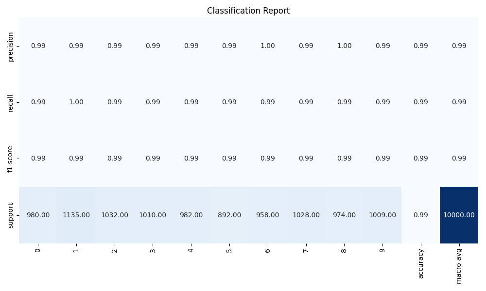
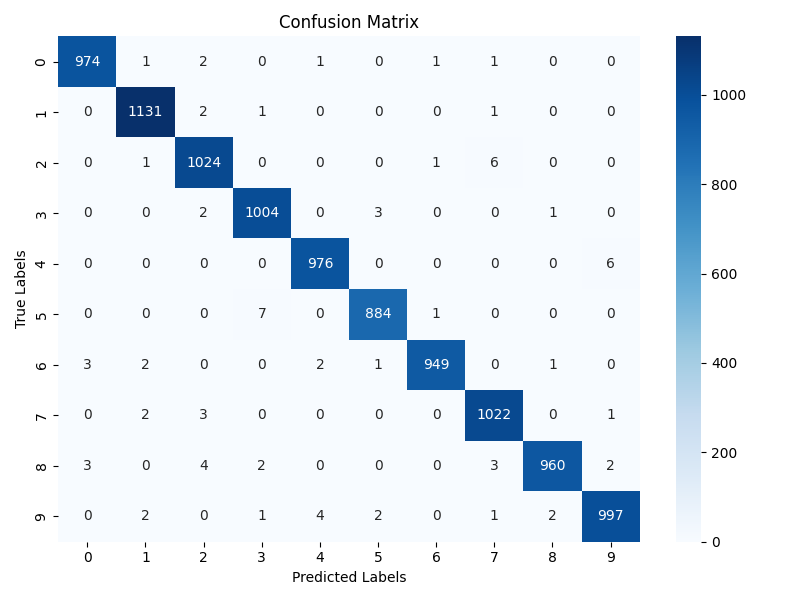
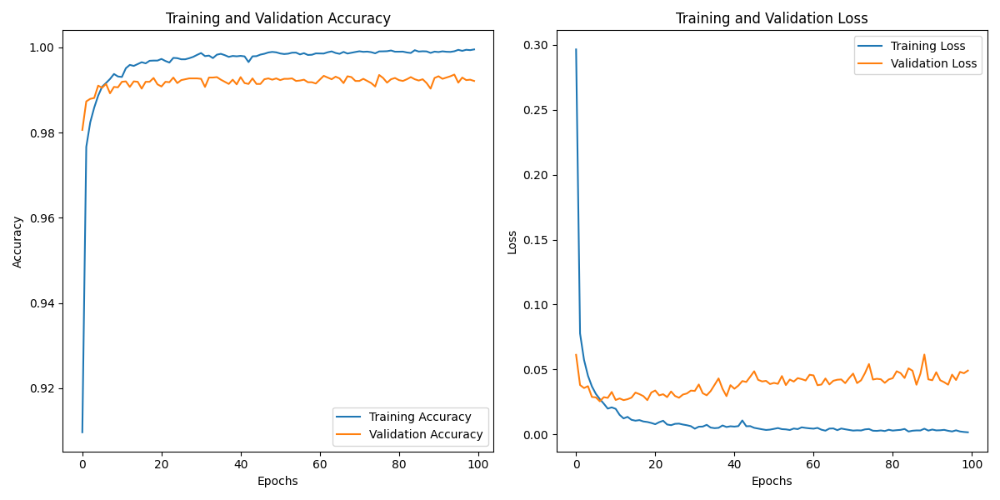
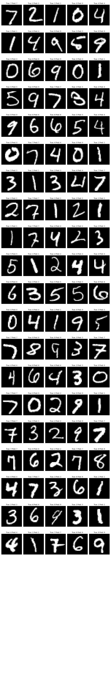

# **MNIST Pattern recognition TensorFlow & Streamlit**

## **Features**
- [x] Multi training.
- [x] GPU/CPU inference.
- [x] UI for interaction.
- [x] Config GPU/NPU/MPS service for all OS.

## **Install**
### Windows/Linux
```bash
pip install -r requirements.txt
```
### MacOS
```bash
pip install -r requirement.macos.txt
```

## **Training**
```bash
python train.py --model_name=mnist_model --save_path=model.keras --epochs=100 --batch_size=512 --multi_gpu=False --num_samples_test=20
```

## **Testing**
```bash
python test.py --image_path=<image_name>.<image_extension>
```

## **Results**
- Classification report


- Confusion matrix


- Training


- Test result

